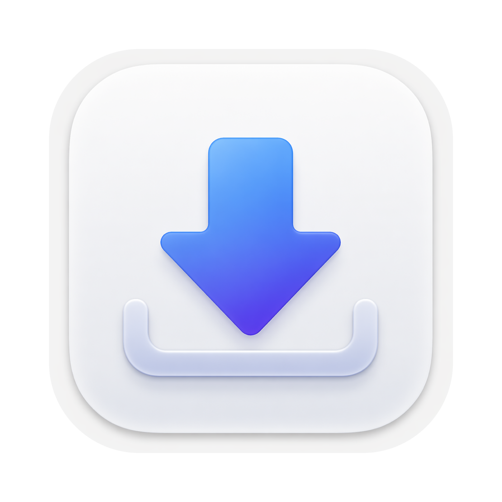
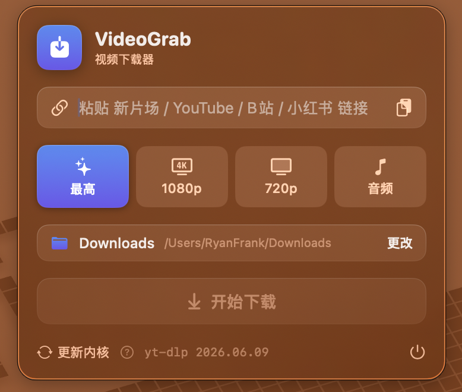

<p align="center">
  
</p>

<h1 align="center">VideoGrab</h1>

<p align="center">
  一个轻量的 macOS 菜单栏小工具：<strong>粘贴链接，一键下载 B站、新片场、小红书、YouTube 视频</strong>。
</p>

<p align="center">
  <strong>中文</strong> ·
  <a href="README.en.md">English</a>
</p>

<p align="center">
  
  
  
</p>

<p align="center">
  
</p>

它常驻菜单栏，打开面板后粘贴（或自动识别剪贴板里的）视频链接，选择画质，即可下载到本地。内置 yt-dlp + ffmpeg，自动处理国内/国外站点的网络分流。

- 🪶 **轻巧**：原生 Swift + SwiftUI，无第三方依赖
- 🔗 **多站点**：B站、新片场、小红书、YouTube（含短链 `b23.tv` / `xhslink.com` / `youtu.be`）
- 🌐 **智能分流**：国内站强制直连，国外站自动探测本地 Clash 代理端口
- 🍪 **登录态**：B站 / 小红书自动读取 Chrome Cookie，无需手动导出
- 📋 **剪贴板预填**：打开面板时自动识别剪贴板中的视频链接
- 📊 **进度与通知**：实时进度条，完成后系统通知，点击打开保存目录

> 📦 **直接下载**：前往 [Releases](https://github.com/aright8-sys/VideoGrab/releases/latest) 下载打包好的 `VideoGrab.zip`，或按下方说明自行构建。

## 🆕 更新日志

### v2.0 — 全新界面 + 小红书支持

这是一次大版本更新，界面与体验全面重做：

- 🌹 **新增小红书下载**：支持 `xiaohongshu.com` / `xhslink.com` 短链，国内直连 + 自动读取 Chrome 登录态。
- 🎨 **界面彻底重做**：卡片化布局 + 毛玻璃背景，呼应 App 图标的蓝→靛蓝品牌渐变，所有卡片加入顶部高光描边，更有质感。
- 🖼️ **全新 App 图标**：重排为符合苹果最新规范的圆角图标（透明留白边距、标准超椭圆圆角），不再是生硬的方块。
- 🎚️ **图标化画质选择器**：最高 / 1080p / 720p / 音频，四个药丸按钮一目了然，选中项高亮。
- 📊 **更美观的下载过程**：自定义渐变进度条 + 大号百分比（数字滚动动画），状态切换带平滑过渡；完成 / 失败以绿、橙色卡片呈现，可一键在访达打开。
- ❓ **「更新内核」说明**：旁边新增可点击的问号，点一下弹出说明，解释「内核」即下载引擎 yt-dlp。
- ✨ **输入框增强**：内联清空按钮、链接图标、一键粘贴。

## ⚠️ 免责声明

> 本项目为个人作品，**与 Bilibili、新片场、YouTube / Google 均无关，未获其授权或背书**。
> 它通过 [yt-dlp](https://github.com/yt-dlp/yt-dlp) 下载视频，可能违反各平台服务条款；
> 下载受版权保护的内容可能涉及法律风险。
>
> **数据流向**：
> - **下载过程**：在本机调用 yt-dlp，视频文件保存到你指定的本地目录。
> - **登录 Cookie**：仅在下载 B站 / 小红书时，从本机 Chrome 浏览器读取登录 Cookie，不上传、不外发。
> - **内核更新**：「更新内核」会从 GitHub 拉取最新 yt-dlp（国外站点，走本地代理）。
>
> 仅供个人学习与自用，**请自行评估并承担使用风险，遵守平台条款与版权法**。

## 工作原理

### 网络分流

不同站点对代理的需求相反，App 会按目标域名自动选择：

| 站点 | 走法 |
| --- | --- |
| 新片场 | 直连 |
| B站 | 直连 + Chrome Cookie |
| 小红书 | 直连 + Chrome Cookie |
| YouTube | 走本地 Clash 代理（7897/7890 等） |

App 启动时会清理继承来的 `*_proxy` 环境变量，避免 GUI 与终端行为不一致。

### 下载内核

首次构建时 `build-app.sh` 会下载 yt-dlp 和 ffmpeg 到 `Resources/bin/`，打包进 `.app`。
首次运行时复制到 `~/Library/Application Support/VideoGrab/bin/`（可写、可自更新）。

### 「更新内核」是什么？

面板底部的「更新内核」指的就是升级下载引擎 **yt-dlp**。VideoGrab 本身只是图形外壳，真正解析网页、抓取视频流、合并音视频的工作全部交给内置的 yt-dlp（配合 ffmpeg）完成，所以它被称为「下载内核」。

各视频网站经常改版或调整反爬策略，旧版 yt-dlp 可能因此下载失败。**当某个链接突然下不动时，先点一次「更新内核」**：

- 执行 `yt-dlp -U`，从 GitHub 拉取并自我升级到最新版；
- GitHub 属国外站点，会自动走探测到的本地代理（无代理则直连）；
- 升级的是 App Support 目录里那份可写副本，**无需重装 App**；
- 完成后底部会显示新的版本号。

## 构建与运行

需要 macOS 14+ 和 Swift 工具链（Xcode 或 Command Line Tools 即可，无需打开 Xcode）。

```bash
./build-app.sh            # 编译并打包成 VideoGrab.app
open VideoGrab.app        # 运行
cp -r VideoGrab.app /Applications/   # 安装（可选）
```

开发调试：

```bash
swift build               # 仅编译
```

## 使用

1. 启动后点击菜单栏的 ⬇️ 图标。
2. 复制视频链接，打开面板（会自动填入剪贴板中的链接）。
3. 选择画质，点击「下载」。
4. **B站 / 小红书首次使用**：若弹出「Chrome Safe Storage」钥匙串窗口，点「始终允许」+ 输入开机密码（只需一次）。部分需登录可见的内容，请先在 Chrome 里登录对应网站。
5. **YouTube**：需先启动本地 Clash 等代理。

## 目录结构

```
Sources/VideoGrab/
  VideoGrabApp.swift   App 入口 + MenuBarExtra
  AppState.swift       状态管理、剪贴板预填、下载调度
  Downloader.swift     yt-dlp 封装、代理分流、进度解析
  Sites.swift          受支持站点域名
  PopoverView.swift    弹出面板 UI
  Notify.swift         下载完成系统通知
build-app.sh           打包脚本（下载内核 + 写入 LSUIElement）
```

## 许可证

[MIT](LICENSE)
